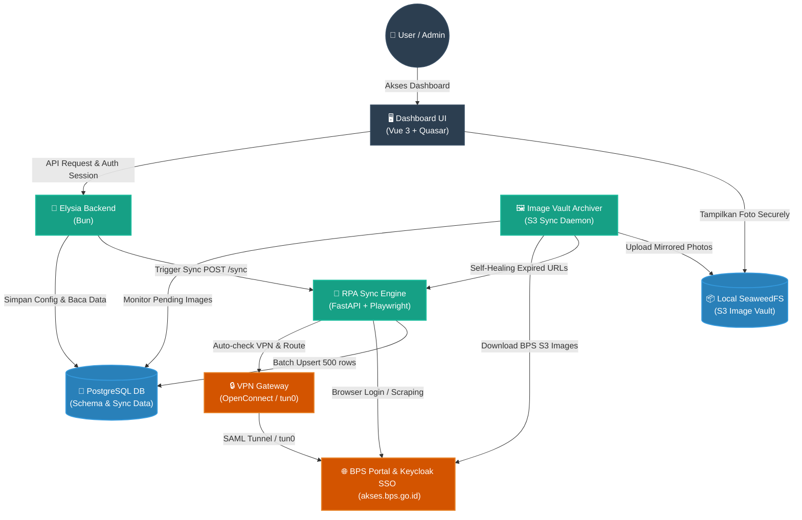
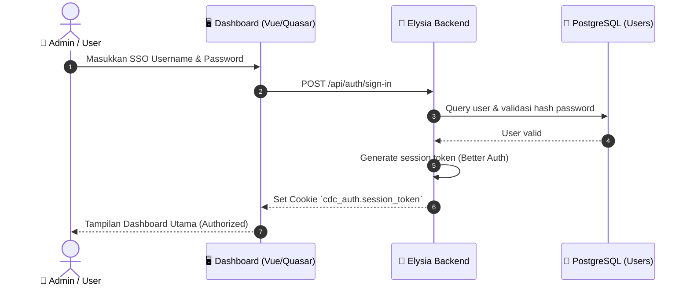
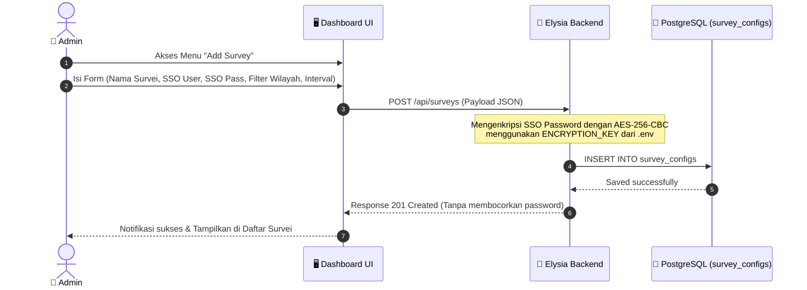
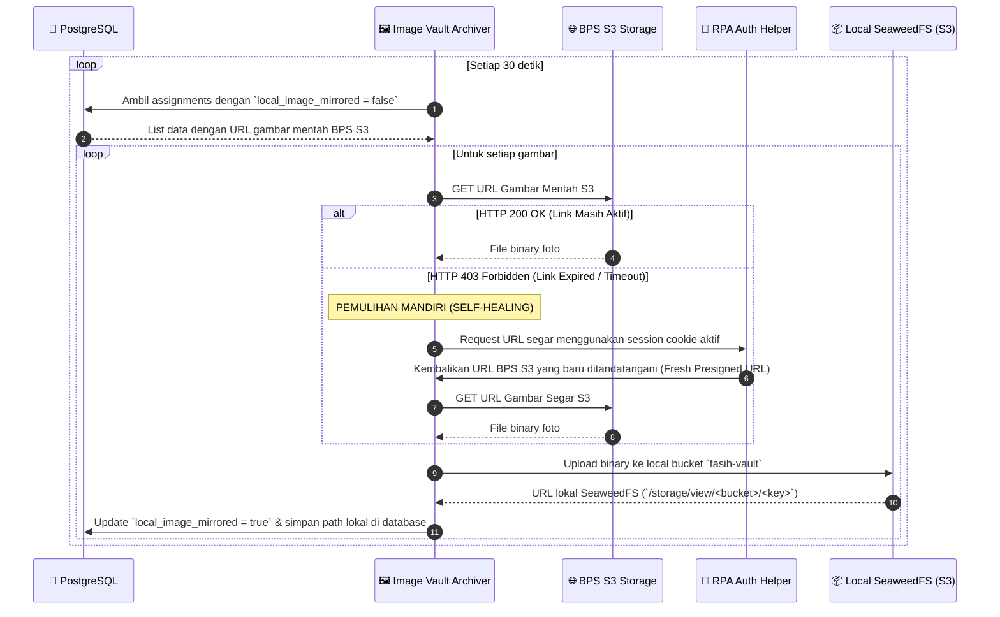
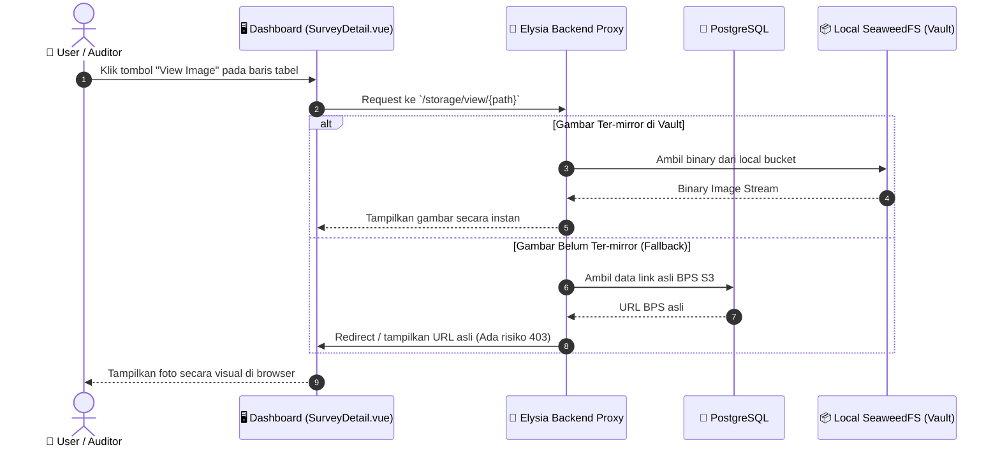

# FasihNexus — Use Case Flow & System Architecture

Dokumen ini mendokumentasikan alur use-case lengkap platform **FasihNexus**, mulai dari otentikasi pengguna, manajemen konfigurasi survei, orkestrasi sinkronisasi data otomatis/manual melalui **Hybrid VPN Gateway**, hingga mirroring foto (*Image Vault*) dengan mekanisme pemulihan mandiri (*Self-Healing*).

---

## 1. End-to-End System Architecture

Sebelum masuk ke detail alur, berikut adalah peta interaksi komponen utama yang terlibat dalam arsitektur **Hybrid Network Bridge** FasihNexus:

---

## 2. Alur Detail Use Case

### Use Case 2.1: User Login (Dashboard Authentication)

FasihNexus menggunakan **Better Auth** pada backend Elysia untuk mengelola otentikasi admin/user secara aman.

> [!NOTE]
> **Better Auth Domain Pinning:** Better Auth sangat ketat dalam memvalidasi origin (`localhost` vs `127.0.0.1`). Konfigurasi `.env` (`BETTER_AUTH_URL`) dan `trustedOrigins` di backend harus benar-benar selaras untuk menghindari error `403 Invalid Origin`.

---

### Use Case 2.2: Menambah Konfigurasi Survei Baru

Admin dapat mendaftarkan survei baru dari menu Dashboard. Password SSO BPS disimpan dengan enkripsi kelas militer (`AES-256-CBC`) agar aman di database.

---

### Use Case 2.3: Sinkronisasi Data Survei (RPA Sync Engine)

Sinkronisasi dapat berjalan otomatis berdasarkan interval waktu (scheduler) atau dipicu secara manual oleh admin dengan menekan tombol **"Sync Now"** di Dashboard.

```mermaid
sequenceDiagram
    autonumber
    actor Admin as 👤 Admin
    participant Web as 🖥️ Dashboard UI
    participant API as 🔌 Elysia Backend
    participant DB as 🐘 PostgreSQL
    participant RPA as 🤖 RPA Sync Engine (FastAPI)
    participant VPN as 🔒 VPN Gateway (tun0)
    participant BPS as 🌐 BPS Portal & Keycloak

    %% Step 1-3: Triggering
    Admin->>Web: Klik tombol "Sync Now"
    Web->>API: POST /api/surveys/:id/sync
    API->>DB: Ambil detail survei & dekripsi password
    API->>RPA: POST /sync (Credentials & Filters)

    %% Step 4-8: VPN Watchdog & Connection
    rect rgb(44, 62, 80)
        Note over RPA, VPN: FASE 0-1: VPN & SSO Bootstrap
        RPA->>VPN: Cek status interface tun0
        alt VPN Disconnected / tun0 Missing
            RPA->>RPA: Jalankan login VPN otomatis (Playwright)
            RPA->>BPS: Navigasi ke akses.bps.go.id & keycloak SSO
            Note over RPA, BPS: Stealth fingerprinting (HTTP/1.1) &<br/>30s Keycloak redirect chain wait
            BPS-->>RPA: Kembalikan SVPNCOOKIE
            RPA->>DB: Update system_settings (vpn_cookie)
            RPA->>VPN: Trigger openconnect reconnect dengan cookie baru
            VPN->>BPS: Membuka tunnel VPN & membuat interface tun0
        end
    end

    %% Step 9-14: Data Retrieval
    rect rgb(22, 160, 133)
        Note over RPA, BPS: FASE 2-3: Data Scraping & Fetching
        RPA->>BPS: Fetch metadata survei, periode, wilayah (Via API tun0)
        BPS-->>RPA: Kembalikan ID Survei & Region Code
        RPA->>BPS: Fetch list assignment (DataTable chunking bypass limit)
        BPS-->>RPA: Kembalikan list assignment IDs
        RPA->>BPS: Fetch detail individual formulir (Concurrent requests)
        BPS-->>RPA: Kembalikan detail data JSON & URL Foto BPS S3
    end

    %% Step 15-18: Save & Finish
    RPA->>DB: Batch Upsert (500 records/batch) ke tabel assignments
    DB-->>RPA: Saved
    RPA-->>API: Sync completed successfully
    API-->>Web: Update status sukses di UI
    Web-->>Admin: Tampilkan data survei terbaru di tabel
```

---

### Use Case 2.4: Mirroring Foto & Self-Healing (Image Vault)

Daemon **Archiver** terus mendeteksi foto-foto survei yang belum ter-mirror di SeaweedFS lokal secara asinkron di background.

---

### Use Case 2.5: Membuka / Menampilkan Foto Survei

Ketika pengguna membuka detail survei di Dashboard, foto ditampilkan **tanpa terkena pemblokiran CORS atau tautan kadaluwarsa (403)** dari server BPS.

---

## 3. Fitur yang Sudah Dieksplorasi & Siap Digunakan

Berdasarkan investigasi codebase FasihNexus saat ini, seluruh blok fitur yang digambarkan dalam diagram use-case di atas **sudah sepenuhnya diimplementasikan dan aktif**:

1. **Dashboard Security & Role Validation:** Menggunakan Elysia middleware `requireAuth` dan `requireAdmin` untuk membatasi aksi sensitif (tambah/edit/hapus survei).
2. **Dynamic Columns:** Tabel Quasar di `SurveyDetail.vue` secara cerdas mendeteksi kolom gambar (`foto`, `image`, `media`) dan secara dinamis menampilkan tombol hijau **Check Circle (Vault)** jika sudah ter-mirror atau tombol biru **Open Link** jika masih fallback.
3. **Cursor-Based Pagination:** Mencegah degradasi performa database ketika tabel `assignments` bertumbuh hingga jutaan baris (5M+ limit).
4. **Self-Healing Loop:** Logic pada `archiver.py` memanfaatkan endpoint RPA `/fresh-urls` untuk memperbarui token URL yang kadaluwarsa tanpa menghentikan worker archiver.
5. **Secure Local Proxy:** Route `/storage/view/` di backend Elysia berfungsi sebagai proxy berkecepatan tinggi ke SeaweedFS lokal, menjamin isolasi jaringan internal BPS yang ketat dari internet luar.

---

*Dokumen ini dibuat secara dinamis dan diposisikan di `/home/ihza/projects/cdc/docs/use-case-flow.md` sebagai panduan referensi arsitektur utama tim pengembang.*
