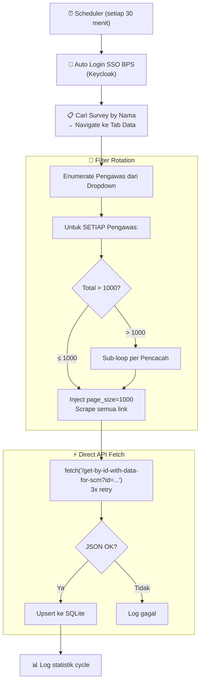

# 🤖 FASIH-SM RPA Sync — Sinkronisasi Data Legacy BPS

> Robot Playwright **fully automated** yang menyedot data JSON dari aplikasi [FASIH-SM BPS](https://fasih-sm.bps.go.id/) secara otomatis lewat VPN, lalu menyimpannya ke database SQLite dengan upsert.

## Fitur

- 🔐 **Login otomatis** — SSO BPS via Keycloak (username + password)
- 📋 **Navigasi survey otomatis** — cari survey berdasarkan nama
- 🔄 **Rotasi filter cerdas** — loop per pengawas/pencacah, bypass limit 1000 baris
- ⚡ **Direct API fetch** — panggil API JSON langsung dari browser context (~0.5 detik/record)
- 💾 **SQLite + Upsert** — insert baru, update jika berubah, skip jika identik
- ⏰ **Scheduler** — jalan otomatis setiap 30 menit (APScheduler)
- 🖥️ **Cross-platform** — CachyOS (dev) + Windows 11 (prod)

---

## Arsitektur



---

## Struktur Folder

```
legacy_rpa_sync/
├── config/
│   ├── .env.example         # Template konfigurasi
│   ├── .env                 # Konfigurasi aktif (buat sendiri)
│   └── settings.py          # Loader konfigurasi
├── src/
│   ├── main.py              # Orchestrator + Scheduler + CLI
│   ├── auth.py              # Auto-login SSO BPS (Keycloak)
│   ├── pages/
│   │   ├── survey_navigator.py  # Cari survey + navigate tab Data
│   │   ├── filter_rotator.py    # Rotate filter pengawas/pencacah
│   │   ├── assignment_page.py   # Inject page size + scrape tabel
│   │   └── detail_page.py       # API fetch dengan retry
│   └── db/
│       ├── connection.py    # SQLite via SQLAlchemy
│       ├── models.py        # ORM models (Assignment, SyncLog)
│       └── repository.py    # Upsert + query logic
├── data/                    # Output: JSON files + SQLite DB
├── logs/                    # Log eksekusi
├── venv/                    # Python Virtual Environment
├── requirements.txt         # Dependensi
└── README.md                # Dokumen ini
```

---

## Cara Menjalankan

### 1. Setup Pertama Kali

```bash
cd /home/ihza/projects/cdc/casestudies/legacy_rpa_sync

# Buat virtual environment (jika belum ada)
python -m venv venv

# Aktifkan venv
source venv/bin/activate.fish    # Fish Shell
# source venv/bin/activate       # Bash
# venv\Scripts\activate          # Windows

# Install dependensi
pip install -r requirements.txt
playwright install chromium
```

### 2. Konfigurasi

```bash
cp config/.env.example config/.env
# Edit config/.env — isi SSO_USERNAME dan SSO_PASSWORD
```

### 3. Jalankan

```bash
# 🧪 Test login saja
python src/main.py --test-login

# 🔍 Dry run (enumerate filter, tanpa fetch)
python src/main.py --dry-run

# ▶️ Jalankan 1 cycle saja
python src/main.py --once

# ⏰ Start scheduler (loop setiap 30 menit)
python src/main.py
```

---

## Konfigurasi (.env)

| Variable | Deskripsi | Default |
|---|---|---|
| `SSO_USERNAME` | Username SSO BPS | *(wajib)* |
| `SSO_PASSWORD` | Password SSO BPS | *(wajib)* |
| `SURVEY_NAME` | Nama survey di tabel | `PEMUTAKHIRAN DTSEN PBI 2026` |
| `FILTER_PROVINSI` | Filter provinsi | *(kosong = semua)* |
| `FILTER_KABUPATEN` | Filter kabupaten | *(kosong = semua)* |
| `FILTER_ROTATION` | `pengawas` atau `pencacah` | `pengawas` |
| `INTERVAL_MINUTES` | Interval scheduler (menit) | `30` |
| `DB_PATH` | Path database SQLite | `data/fasih_sync.db` |

---

## Strategi Teknis

### Mengapa Rotasi Filter per Pengawas?

Tabel assignment FASIH memiliki **hard limit 1000 baris**. Bahkan dengan pagination, baris ke-1001+ tidak bisa diakses. Solusi:

| Skenario | Strategi |
|---|---|
| Per pengawas ≤ 1000 | Inject page_size=1000, scrape 1 halaman |
| Per pengawas > 1000 | Otomatis sub-loop per pencacah (~30 per pencacah) |

### Upsert Logic (SQLite)

| Kondisi | Aksi |
|---|---|
| `_id` belum ada di DB | INSERT baru |
| `_id` ada, `date_modified` berubah | UPDATE data |
| `_id` ada, `date_modified` sama | SKIP (tidak ada perubahan) |

### Kolom `synced_to_api`

Setiap record memiliki flag `synced_to_api`. Gunakan untuk batch-send ke API downstream:
```python
unsynced = session.query(Assignment).filter(Assignment.synced_to_api == False).all()
```

---

## API Endpoint

```
GET /assignment-general/api/assignment/get-by-id-with-data-for-scm?id={ASSIGNMENT_UUID}
```

**Response:** JSON lengkap berisi `pre_defined_data`, `data`, `region`, `assignment_status`, dan metadata.
